# Настройка приложений для подключения к серверу XRAY


- Инструкции на этой странице рассчитаны на приложения, которые могут подключаться к серверу XRAY по протоколу VLESS с поддержкой Reality. 

- Для каждой операционной системы выполнение всех шагов обязательно во избежание проблем.

- Если инструкции вызывают затруднения, обратитесь к подрастающему поколению 😎

**Содержание**

- [Настройка приложений для подключения к серверу XRAY](#настройка-приложений-для-подключения-к-серверу-xray)
- [Как работает обход блокировок](#как-работает-обход-блокировок)

- [Android](#android-v2rayng)
  - [Загрузка и установка v2rayNG](#загрузка-и-установка-v2rayng)
  - [Импорт серверов в v2rayNG](#импорт-серверов-в-v2rayng)
    - [Импорт серверов в v2rayNG с помощью ссылки](#импорт-серверов-в-v2rayng-с-помощью-ссылки)
    - [Импорт серверов в v2rayNG с помощью подписки](#импорт-серверов-в-v2rayng-с-помощью-подписки)
  - [Управление состоянием подключения v2rayNG](#управление-состоянием-подключения-v2rayng)
  - [Выбор отдельных приложений в v2rayNG](#выбор-отдельных-приложений-в-v2rayng)
  - [Добавление маршрутов в v2rayNG](#добавление-маршрутов-в-v2rayng)
    - [Проверка маршрутов в v2rayNG](#проверка-маршрутов-в-v2rayng)

- [Android Nekobox](#android-nekobox)
  - [Загрузка и установка Nekobox](#загрузка-и-установка-nekobox)
  - [Импорт конфигурации в Nekobox](#импорт-конфигурации-в-nekobox)
  - [Управление состоянием подключения Nekobox](#управление-состоянием-подключения-nekobox)
  - [Выбор отдельных приложений в Nekobox](#выбор-отдельных-приложений-в-nekobox)

- [Windows](#windows)
  - [Загрузка и установка](#загрузка-и-установка)
  - [Импорт конфигурации в приложение](#импорт-конфигурации-в-приложение)
    - [Импорт серверов с помощью ссылки](#импорт-серверов-с-помощью-ссылки)
    - [Импорт серверов с помощью подписки](#импорт-серверов-с-помощью-подписки)
    - [Обновление подписки](#обновление-подписки)
  - [Настройка Firefox для работы через прокси](#настройка-firefox-для-работы-через-прокси)
  - [Активация подключения к серверу (режим прокси)](#активация-подключения-к-серверу-режим-прокси)
  - [Управление состоянием приложения и подключений](#управление-состоянием-приложения-и-подключений)
  - [Настройка маршрутизации](#настройка-маршрутизации)
  - [Добавление маршрутов](#добавление-маршрутов)
    - [Проверка маршрутов](#проверка-маршрутов)

- [iOS](#ios)
  - [Приложения](#приложения)
  - [Импорт конфигурации в приложение с помощью ссылки](#импорт-конфигурации-в-приложение-с-помощью-ссылки)

- [Диагностика проблем](#диагностика-проблем)
  - [Сбор логов](#сбор-логов)
    - [Android v2rayNG](#android-v2rayng-1)
    - [Windows](#windows-1)

## Как работает обход блокировок

- Трафик маскируется под крупный сайт (например, microsoft.com) и выглядит для цензора как обычный веб-серфинг.

- На Android можно настроить обход блокировок только для избранных приложений (Telegram, Instagram, YouTube). В Windows это возможно только для приложений, которые умеют ходить через прокси - например, браузер или Telegram (кроме звонков).

- С помощью правил маршрутизации настраивается тонкое поведение приложений. Например, браузер будет ходить на заблокированные цензором сайты через прокси, а на все остальные - напрямую. Если зарубежный сайт блокирует пользователей из РФ, на него тоже можно ходить через прокси. Сервер также может задавать и переопределять маршруты.
 
## Android v2rayNG

### Загрузка и установка v2rayNG

[https://github.com/2dust/v2rayNG/releases/](https://github.com/2dust/v2rayNG/releases/)

1. Выберите Latest, нежели pre-release
2. В подразделе Assets выберите файл APK с **universal** в имени.
3. Скачайте, установите.

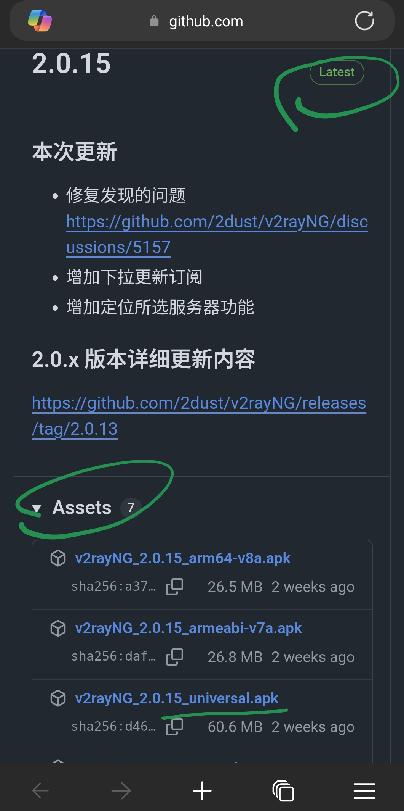

### Импорт серверов в v2rayNG
Есть несколько способов: сканирование QR-кода, импорт ссылки и даже импорт подписки на серверы.

#### Импорт серверов в v2rayNG с помощью ссылки
1. Скопируйте присланную ссылку вида VLESS:// в буфер обмена.
2. В приложении нажмите ➕, затем **Импорт из буфера обмена**.

#### Импорт серверов в v2rayNG с помощью подписки
Посредством подписки можно импортировать несколько серверов в один прием, а также обновлять их список по запросу или  автоматически.

1. Скопируйте присланную вам веб-ссылку в буфер обмена.
2. В приложении нажмите Меню ≡ - **Группы** - измените группу **Default** (проще) или создайте новую и заполните поля:
  - **Название**: любое понятное вам
  - **URL (необязательно)**: вставьте ссылку из буфера обмена - для вас это обязательно! И нажмите ✔️.

3. В списке групп нажмите ↩️, чтобы добавить серверы из подписки.

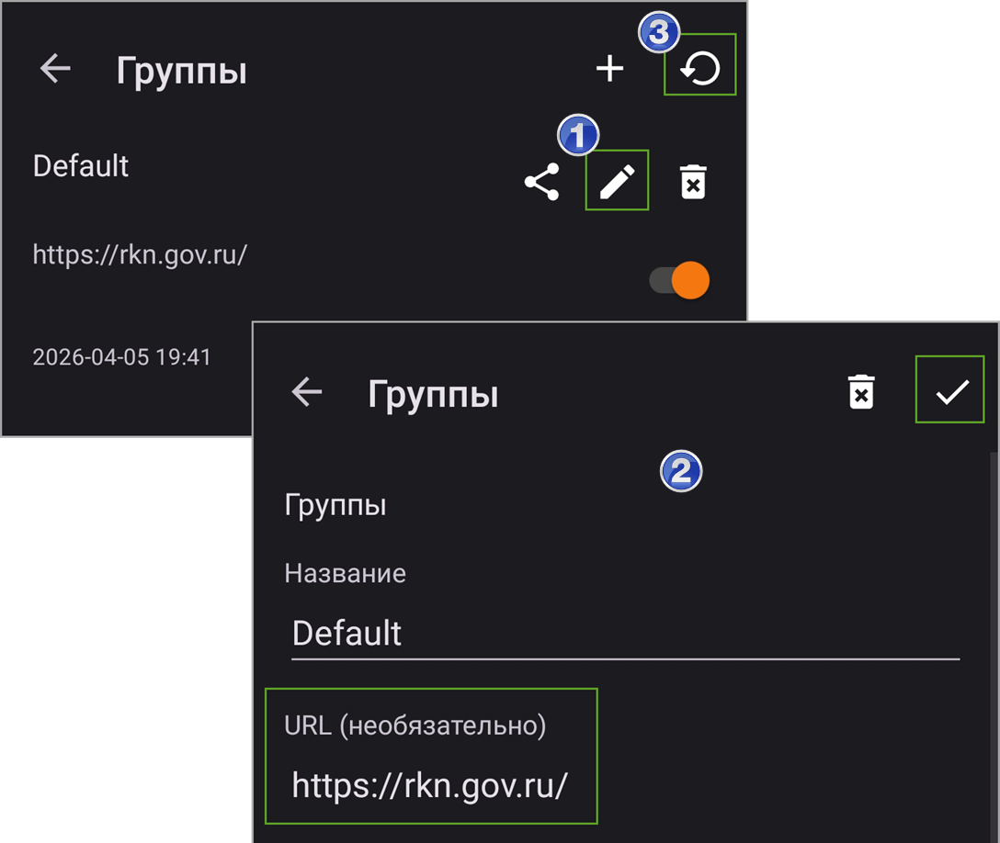

В дальнейшем вы можете обновлять список серверов из Меню ≡ - **Группы** - ↩️

### Управление состоянием подключения v2rayNG
Рекомендуется настроить только конкретные приложения, как описано ниже, после чего активировать подключение и не отключать. 

В Android приложение v2rayNG добавляет свою плитку в шторку. Нужно перейти в настройки шторки и перетащить приложение в начало списка. 

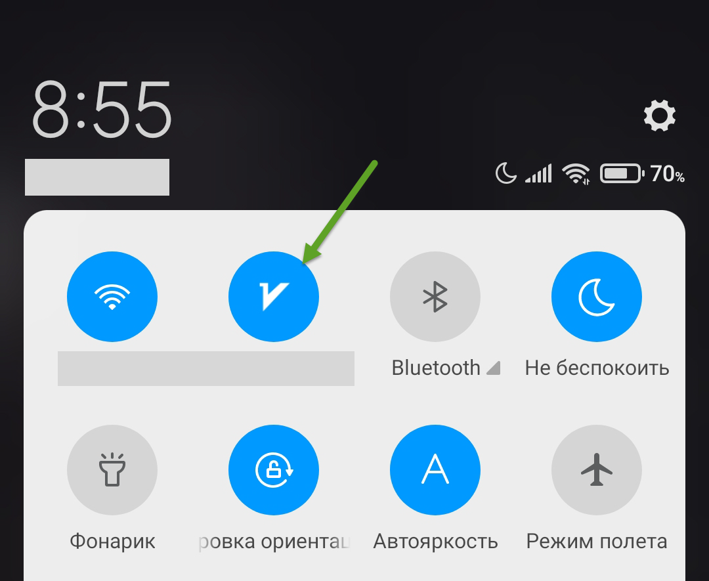

Короткое нажатие на плитку будет включать или отключать сервис, а долгое нажатие - открывать приложение.

### Выбор отдельных приложений в v2rayNG
Чтобы только выбранные приложения ходили в обход блокировок:
1. Меню ≡ - **Выбор приложений** - **Использовать выбор приложений**: включить
2. Выберите из списка приложения, которые должны ходить через сервер. Если вам нужно посещать отдельные заблокированные сайты в браузере, выберите **не основной** браузер.

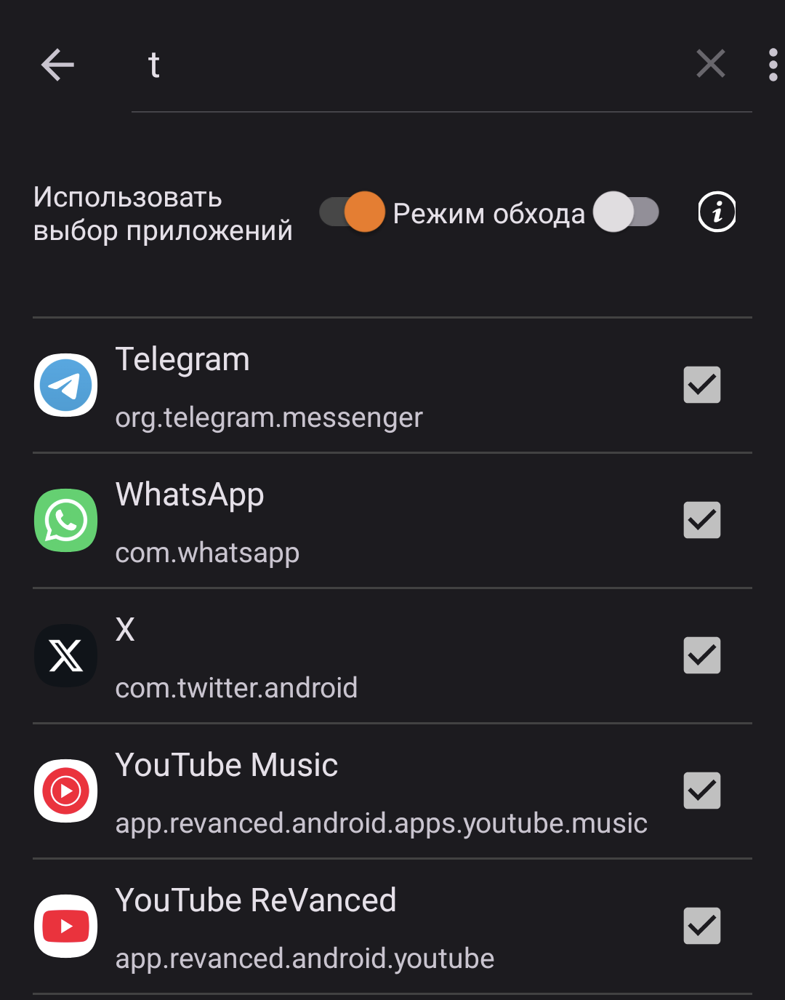

### Добавление маршрутов в v2rayNG
1. Скопируйте эти правила в буфер обмена:
```
[{"enabled":true,"locked":false,"network":"udp","outboundTag":"block","port":"443","remarks":"Блокировать QUIC"},{"domain":["geosite:category-ads-all"],"enabled":true,"locked":false,"outboundTag":"block","remarks":"Блокировать рекламу "},{"enabled":true,"locked":false,"outboundTag":"direct","protocol":["bittorent"],"remarks":"Торрент - напрямую"},{"enabled":true,"ip":["geoip:private"],"locked":false,"outboundTag":"direct","remarks":"Частные сети - напрямую"},{"domain":["geosite:private"],"enabled":true,"locked":false,"outboundTag":"direct","remarks":"Частные домены - напрямую"},{"enabled":false,"ip":["1.0.0.1","1.1.1.1","8.8.8.8","8.8.4.4"],"locked":false,"outboundTag":"proxy","remarks":"DNS - прокси"},{"domain":["720pier.ru"],"enabled":true,"locked":false,"outboundTag":"proxy","remarks":"Избранные сайты - прокси"},{"domain":["geosite:category-ip-geo-detect"],"enabled":true,"locked":false,"outboundTag":"direct","remarks":"Сервисы определения IP - напрямую"},{"domain":["yandex.net","yastatic.net","gstatic.com"],"enabled":true,"locked":false,"outboundTag":"direct","remarks":"Избранные сайты - напрямую"},{"domain":["geosite:category-ru"],"enabled":true,"locked":false,"outboundTag":"direct","remarks":"Российские домены - напрямую"},{"domain":["domain:ru","domain:xn--p1ai"],"enabled":true,"locked":false,"outboundTag":"direct","remarks":"Домены .RU, .РФ - напрямую"},{"enabled":true,"ip":["geoip:ru"],"locked":false,"outboundTag":"direct","remarks":"Российские IP - напрямую"},{"enabled":true,"locked":false,"outboundTag":"proxy","port":"0-65535","remarks":"Все остальное - прокси"}]
```

2. Меню ≡ - **Маршрутизация** - ︙(в правом верхнем углу) - **Импорт правил из буфера обмена**. Согласитесь на удаление существующих правил.

#### Проверка маршрутов в v2rayNG

Перезапустите подключение и убедитесь, что выбранные↑ вами приложения работают.

## Android Nekobox
Инструкции на этой странице подразумевают, что вам предоставлена конфигурация (файл JSON) для импорта в приложение. В конфигурацию входит:

- Настройки Nekobox. Вам не нужно их менять.
- Подписка на серверы. Вам не нужно ничего добавлять вручную, но эта возможность имеется.
- Список приложений для работы через прокси. Сразу включены Telegram, Instagram, YouTube / Revanced и некоторые другие приложения. Вы можете добавить в список свои при необходимости.
- Правила маршрутизации. Вам не нужно их менять, но эта возможность имеется.

### Загрузка и установка Nekobox

[https://github.com/MatsuriDayo/NekoBoxForAndroid/releases](https://github.com/MatsuriDayo/NekoBoxForAndroid/releases)

1. Выберите Latest, нежели pre-release
2. В подразделе Assets выберите файл APK с **arm64-v8a** в имени.
3. Скачайте, установите.

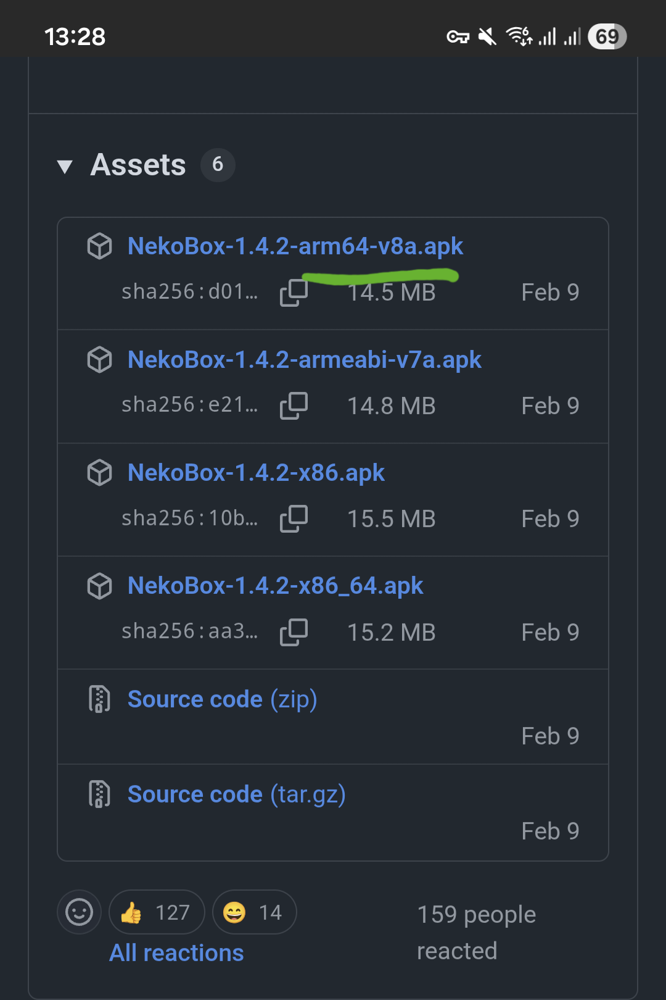

### Импорт конфигурации в Nekobox

1. Сохраните присланный вам файл JSON, например, в папке Загрузки.
2. Меню ≡ - **Инструменты** - **Бэкап** - **Импортировать из файла** - выберите сохраненный файл и согласитесь на перезапись всех настроек.

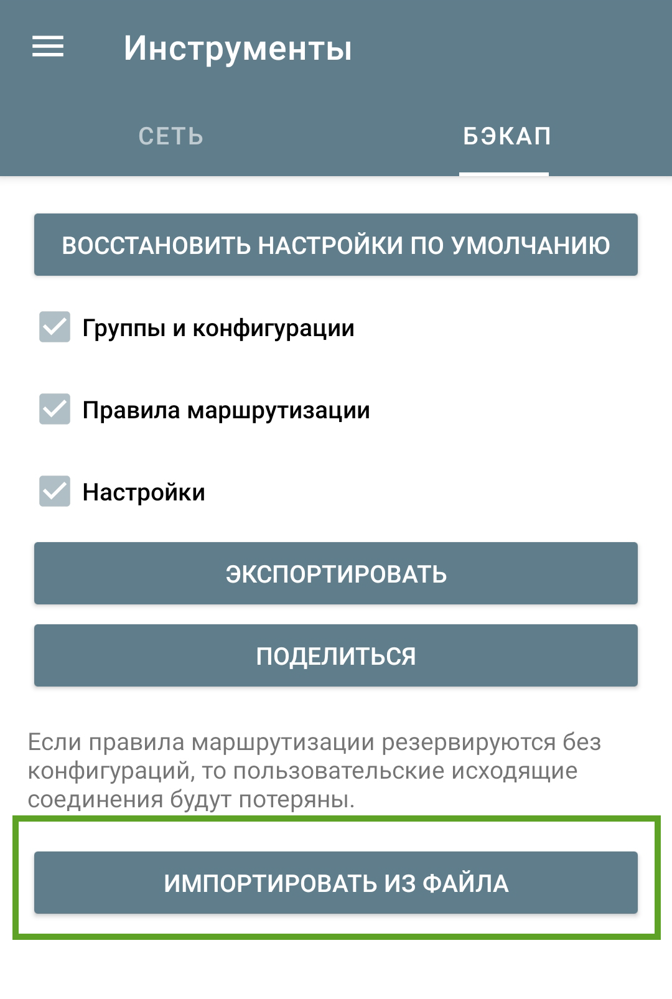

### Управление состоянием подключения Nekobox
Когда настроены конкретные приложения, можно активировать подключение и не отключать. Nekobox добавляет постоянное уведомление, а также свою плитку в шторку. Нужно перейти в настройки шторки и перетащить в начало списка плитку с перечеркнутым бумажным самолетиком или пузатым котом 😺 (зависит от устройства). 

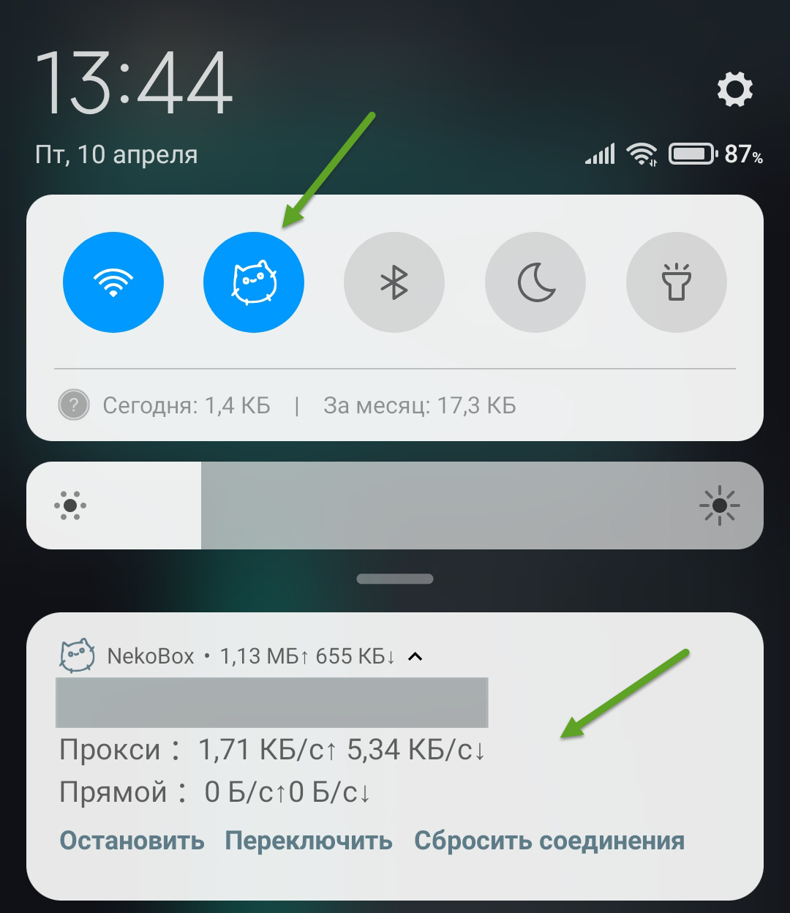

Короткое нажатие на плитку будет включать или отключать сервис, а долгое нажатие - открывать приложение.

### Выбор отдельных приложений в Nekobox
**Примечание**. В предоставленной вам конфигурации уже заложен список приложений. Шаги ниже необходимы только для тех приложений, которых нет в списке изначально.

Чтобы только выбранные приложения ходили в обход блокировок:
1. Меню ≡ - **Настройки** - **Режим VPN для приложений** - **Прокси**: выделен (нажать).
2. Выберите из списка приложения, которые должны ходить через сервер.
3. Меню ≡ - **Настройки** - **Маршруты** - найдите правило **Избранные приложения - прокси** в конце списка - перейдите в режим редактирования, нажав на карандаш ✏️- нажмите **Приложения** и добавьте в список свои. (Если такого правила нет, создайте его и поместите внизу перед правилом **Все остальное - прокси**. Внесите свои приложения в правило и убедитесь, что внизу правила указано **outbound: прокси**.)

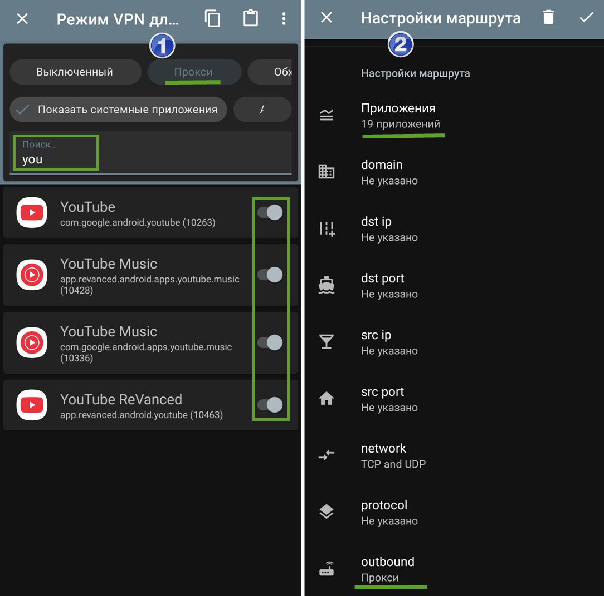

## Windows

### Загрузка и установка
[v2rayN](https://github.com/2dust/v2rayN/)

1. Скачайте архив [https://github.com/2dust/v2rayN/releases/latest/download/v2rayN-windows-64-desktop.zip](https://github.com/2dust/v2rayN/releases/latest/download/v2rayN-windows-64-desktop.zip)
2. Распакуйте архив и запустите **v2rayN.exe**.
3. Если надо сменить язык, нажмите ︙(в правом верхнем углу) - выберите язык - нажмите **Выход** в верхнем меню.

### Импорт конфигурации в приложение

#### Импорт серверов с помощью ссылки
Самый распространенный способ. 
1. Скопируйте присланную ссылку вида VLESS:// в буфер обмена.
2. Щелкните мышью в верхней части окна и нажмите **Ctrl+V**. Либо щелкните **Серверы** - **Импорт массива URL из буфера обмена**.

#### Импорт серверов с помощью подписки
1. Скопируйте присланную вам веб-ссылку в буфер обмена.
2. В верхнем меню **Группа подписки** - **Настройка группы подписки**
3. Нажмите **Добавить** и заполните поля
  - **Примечание**: любое понятное вам
  - **URL (необязательно)**: вставьте ссылку из буфера обмена - для вас это обязательно!
4. Нажмите **Подтвердить** и вернитесь на главный экран.

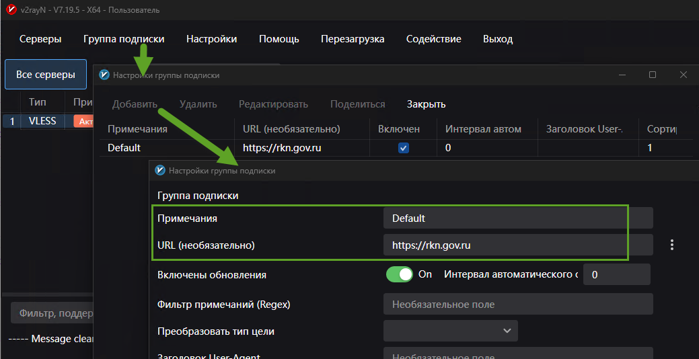

#### Обновление подписки
Чтобы получить список серверов из подписки, нажмите в верхнем меню **Группа подписки** и выберите любой вариант обновления. Список серверов пополнится новыми.

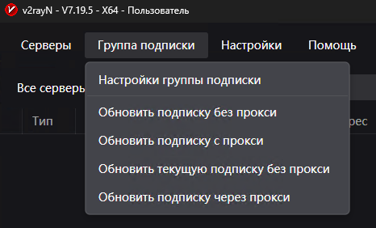

**Примечание**. Старые серверы может понадобиться удалить вручную.

###  Настройка Firefox для работы через прокси
Чтобы снизить риск обнаружения сервера цензором, **рекомендуется использовать отдельный браузер - Firefox**. В нем следует посещать все сайты, доступ к которым ограничивается. Все остальные сайты посещайте в любимом браузере. Если Firefox - ваш любимый, в нем можно создать два профиля и запускать каждый с ключом `-no-remote`.

1. Установите [Firefox](https://www.firefox.com/).
2. Меню ≡ - **Настройки** - (внизу) **Настройки прокси** - задайте SOCKS сервер `127.0.0.1` на порту `10808`.
3. Проверьте работу прокси, перейдя в браузере по ссылкам:
  - [https://rutracker.org/](https://rutracker.org/) - ресурс, который заблокировал РКН
  - [https://www.strava.com/](https://www.strava.com) - ресурс, который сам заблокировал доступ из РФ

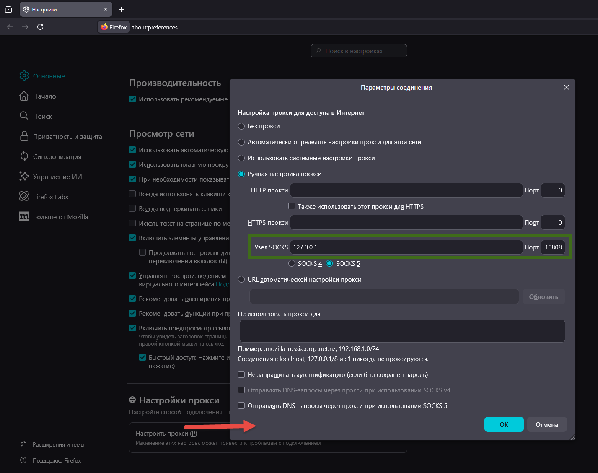

### Активация подключения к серверу (режим прокси)
Этот режим **не рекомендуется** без острой необходимости, потому что через системный прокси будут ходить все приложения, которые поддерживают эту функцию. Это повышает риск выявления сервера цензором.

1. Выделите подключение в списке и нажмите Enter либо щелкните **Перезагрузка** в верхнем меню.
2. Внизу приложения выберите из списка **Установить системный прокси**.
3. Проверьте работу прокси, как описано выше для Firefox.

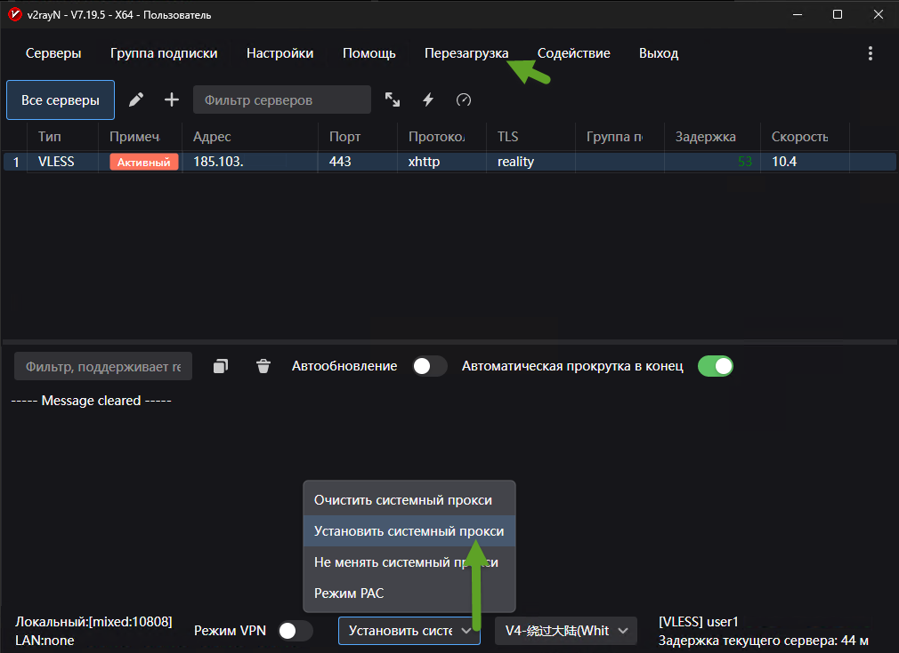

### Управление состоянием приложения и подключений
- Приложение отображает значок в трее рядом с часами. Возможно, понадобится вытащить значок в видимую область.
- Красный значок - обход блокировок активен. Синий - неактивен.
- Правой кнопкой мыши на значке можно вызвать меню быстрого управления приложением.

### Настройка маршрутизации

### Добавление маршрутов
Набор правил слегка отличается от того, что используется на Android. 

1. Скопируйте эти правила в буфер обмена:
```
[{"enabled":true,"locked":false,"outboundTag":"direct","protocol":["bittorent"],"remarks":"Торрент - напрямую"},{"domain":["geosite:category-ads-all"],"enabled":true,"locked":false,"outboundTag":"block","remarks":"Блокировать рекламу "},{"enabled":true,"ip":["geoip:private"],"locked":false,"outboundTag":"direct","remarks":"Частные сети - напрямую"},{"domain":["geosite:private"],"enabled":true,"locked":false,"outboundTag":"direct","remarks":"Частные домены - напрямую"},{"enabled":false,"ip":["1.0.0.1","1.1.1.1","8.8.8.8","8.8.4.4"],"locked":false,"outboundTag":"proxy","remarks":"DNS - прокси"},{"domain":["720pier.ru"],"enabled":true,"locked":false,"outboundTag":"proxy","remarks":"Избранные сайты - прокси"},{"domain":["geosite:category-ip-geo-detect"],"enabled":true,"locked":false,"outboundTag":"direct","remarks":"Сервисы определения IP - напрямую"},{"domain":["yandex.net","yastatic.net","gstatic.com"],"enabled":true,"locked":false,"outboundTag":"direct","remarks":"Избранные сайты - напрямую"},{"domain":["geosite:category-ru"],"enabled":true,"locked":false,"outboundTag":"direct","remarks":"Российские домены - напрямую"},{"domain":["domain:ru","domain:xn--p1ai"],"enabled":true,"locked":false,"outboundTag":"direct","remarks":"Домены .RU, .РФ - напрямую"},{"enabled":true,"ip":["geoip:ru"],"locked":false,"outboundTag":"direct","remarks":"Российские IP - напрямую"},{"enabled":true,"locked":false,"outboundTag":"proxy","port":"0-65535","remarks":"Все остальное - прокси"}]
```
2. В верхнем меню **Настройки** - **Настройки маршрутизации** - **Добавить** - **Импорт правил из буфера обмена**. Там же в поле **Примечания** задайте имя: **Мои правила**.
3. Дважды нажмите **Подтвердить**.
4. В нижнем меню выберите из списка **Мои правила**.

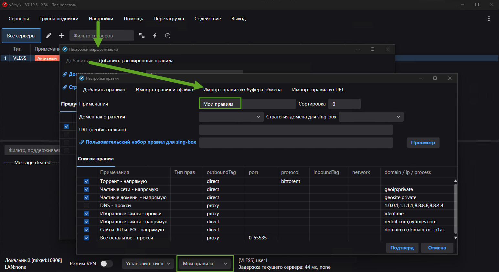

Названия и состояния правил в п. 1 могут слегка отличаться от показанных на картинке. Это нормально.

#### Проверка маршрутов

Перезапустите подключение и убедитесь, что маршруты работают правильно:
- [https://rutracker.org/](https://rutracker.org/) - открывается ресурс, который заблокировал РКН
- [https://www.strava.com/](https://www.strava.com) - открывается ресурс, который сам заблокировал доступ из РФ

Примечание. В зависимости от набора правил маршрутизации на клиенте и сервере, зарубежные сервисы определения ip-адреса могут показывать адрес вашего провайдера либо не открываться вообще.

## iOS
### Приложения
- [Happ](https://apps.apple.com/ru/app/happ-proxy-utility-plus/id6746188973)
- [One Xray](https://apps.apple.com/ru/app/onexray/id6745748773)
- [V2Box](https://apps.apple.com/ru/app/v2box-v2ray-client/id6446814690) (удален из AppStore)

### Импорт конфигурации в приложение с помощью ссылки
1. Скопируйте присланную ссылку вида VLESS:// в буфер обмена.
2. В приложении нажмите ➕, затем **Импорт из буфера обмена** или похожий пункт.

## Диагностика проблем
Здесь возможные проблемы и пути их решения. 

### Сбор логов
Вас могут попросить предоставить логи, например, когда не удается подключиться к серверу.

#### Android v2rayNG
1. Меню ≡ - **Настройки** - **Подробность ведения журнала**: warning.
2. Меню ≡ - **Журнал** - нажмите кнопку корзины 🗑️ в правом верхнем углу, чтобы очистить лог, даже если на экране ничего нет.
3. Вернитесь назад и  попробуйте подключиться к серверу.
4. Меню ≡ - **Журнал** - потяните страницу вниз для обновления, затем скопируйте журнал кнопкой в правом верхнем углу.

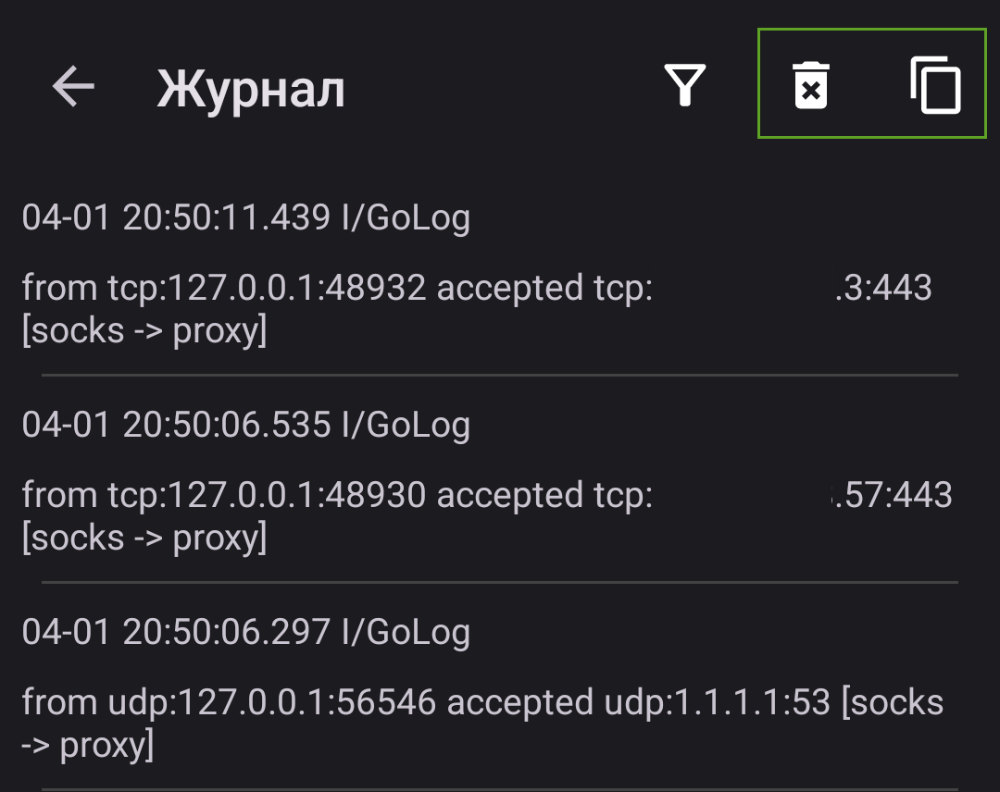 

#### Windows
1. В нижней половине окна включите автообновление, затем нажмите значок корзины 🗑️, чтобы очистить лог.
2. В верхней половине окна выделите сервер, затем нажмите **Перезагрузка** в верхнем меню.
3. В нижней половине окна скопируйте лог кнопкой слева от корзины.

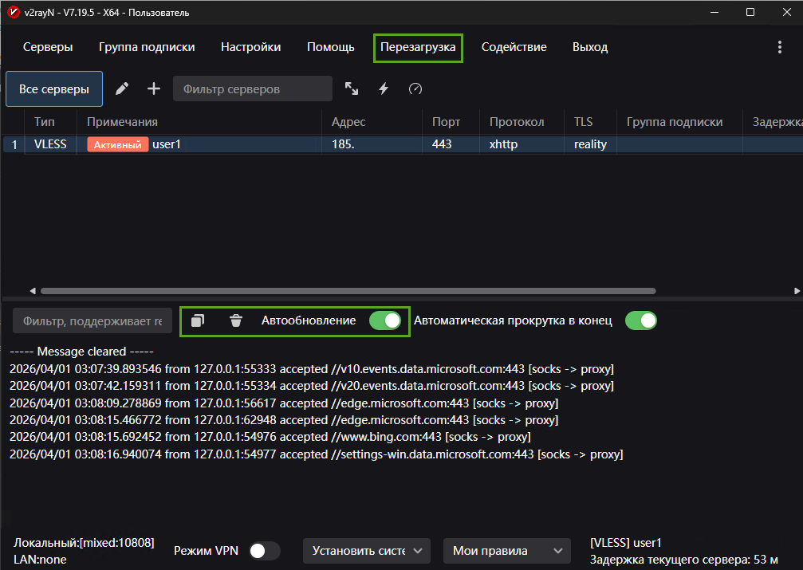 

