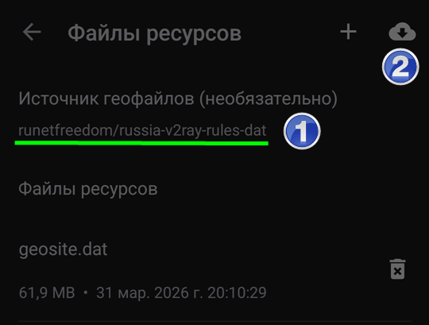
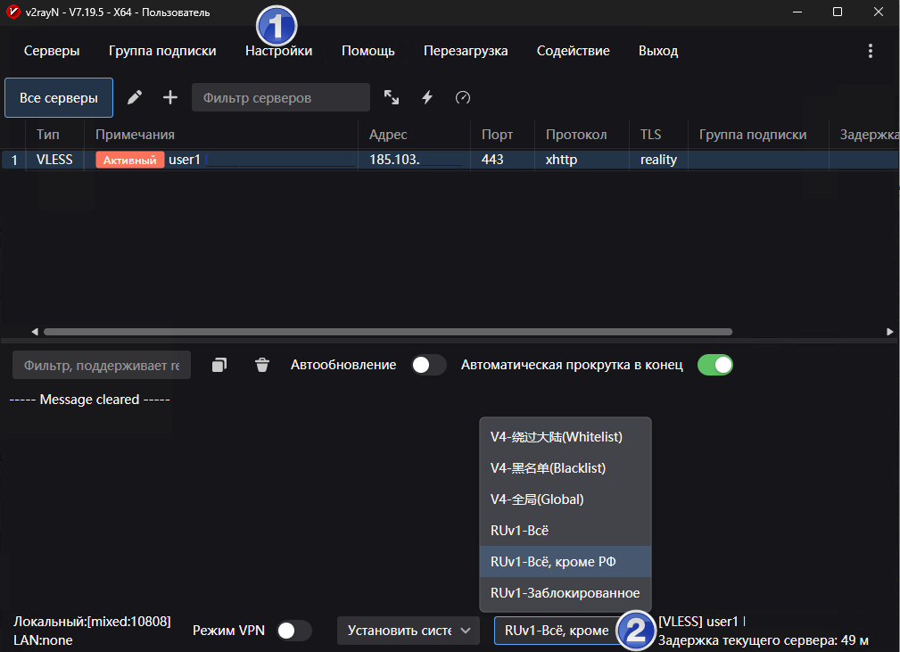

# Настройка приложений для подключения к серверу XRAY


- Инструкции на этой странице рассчитаны на приложения, которые могут подключаться к серверу XRAY посредством VLESS XHTTP Reality. Но шаги подойдут и для других протоколов.

- Для каждой операционной системы выполнение всех шагов обязательно во избежание проблем.

- Если инструкции вызывают затруднения, обратитесь к подрастающему поколению 😎

## Содержание

- [Как работает обход блокировок](#как-работает-обход-блокировок)
- [Android](#android)
  - [Загрузка и установка](#загрузка-и-установка)
  - [Импорт конфигурации в приложение с помощью ссылки](#импорт-конфигурации-в-приложение-с-помощью-ссылки)
  - [Управление состоянием подключения](#управление-состоянием-подключения)
  - [Настройка проксирования отдельных приложений](#настройка-проксирования-отдельных-приложений)
  - [Настройка маршрутизации](#настройка-маршрутизации)
- [Windows](#windows)
  - [Загрузка и установка](#загрузка-и-установка-1)
  - [Импорт конфигурации в приложение с помощью ссылки](#импорт-конфигурации-в-приложение-с-помощью-ссылки-1)
  - [Активация подключения к серверу (режим прокси)](#активация-подключения-к-серверу-режим-прокси)
  - [Управление состоянием приложения и подключений](#управление-состоянием-приложения-и-подключений)
  - [Настройка маршрутизации](#настройка-маршрутизации-1)
- [iOS](#ios)
  - [Приложения](#приложения)
  - [Импорт конфигурации в приложение с помощью ссылки](#импорт-конфигурации-в-приложение-с-помощью-ссылки-2)  
- [Диагностика проблем](#диагностика-проблем)


## Как работает обход блокировок

- Трафик маскируется под крупный сайт (например, microsoft.com) и выглядит для цензора как обычный веб-серфинг.

- На Android можно настроить обход блокировок только для избранных приложений (Telegram, Instagram, YouTube). В Windows это возможно только для приложений, которые умеют ходить через прокси - например, браузер или Telegram (кроме звонков).

- Для разблокировки конкретных сайтов и IP адресов приложения скачивают специальные файлы - списки заблокированных ресурсов. На эти списки опираются правила маршрутизации трафика.

- С помощью правил маршрутизации настраивается тонкое поведение приложений (если сервер не переопредляет маршруты). Например, браузер будет ходить на заблокированные РКН сайты через прокси, а на все остальные - напрямую. Если зарубежный сайт блокирует пользователей из РФ, на него тоже можно ходить через прокси.
 
## Android

### Загрузка и установка

[https://github.com/2dust/v2rayNG/releases/](https://github.com/2dust/v2rayNG/releases/)

1. Выберите Latest, нежели pre-release
2. В подразделе Assets выбрерите файл APK с `universal` в имени.
3. Скачайте, установите.


### Импорт конфигурации в приложение с помощью ссылки

1. Скопируйте присланную ссылку вида VLESS:// в буфер обмена.
2. В приложении нажмите ➕, затем `Импорт из буфера обмена`.

### Управление состоянием подключения
Логично настроить только конкретные приложения, как описано ниже, после чего включить и не отключать. 

В Android приложение v2rayNG добавляет свою плитку в шторку. Нужно перейти в настройки шторки и перетащить приложение в начало списка. После чего короткое нажатие на плитку будет включать или отключать, а долгое нажатие - открывать приложение.

### Настройка проксирования отдельных приложений
Чтобы только выбранные приложения ходили в обход блокировок:
1. Меню ≡  - `Выбор приложений` - `Использовать выбор приложений`: включить
2. Выберите из списка приложения, которые должны ходить через сервер.


### Настройка маршрутизации
Сначала нужно указать и скачать правильные файлы ресурсов для обхода блокировок, затем добавить маршруты обхода.

#### Загрузка ресурсов
1. Меню ≡ - `Файлы ресурсов` - выберите источник runetfreedom.
2. Загрузите файлы из облака и дождитесь, пока они скачаются (обновятся даты файлов).



#### Добавление маршрутов
1. Скопируйте эти правила в буфер обмена:
```
[{"enabled":true,"locked":false,"outboundTag":"direct","protocol":["bittorrent"],"remarks":"Торрент - напрямую"},{"domain":["geosite:category-ads-all"],"enabled":true,"locked":false,"outboundTag":"block","remarks":"Блокировать рекламу"},{"enabled":true,"ip":["geoip:private"],"locked":false,"outboundTag":"direct","remarks":"Частные сети - напрямую"},{"domain":["geosite:private"],"enabled":true,"locked":false,"outboundTag":"direct","remarks":"Частные домены - напрямую"},{"enabled":true,"ip":["1.0.0.1","1.1.1.1","8.8.8.8","8.8.4.4"],"locked":false,"outboundTag":"proxy","remarks":"DNS - прокси"},{"enabled":true,"ip":["geoip:ru-blocked"],"locked":false,"outboundTag":"proxy","remarks":"Заблокированные IP в РФ - прокси"},{"domain":["geosite:ru-blocked"],"enabled":true,"locked":false,"outboundTag":"proxy","remarks":"Заблокированные домены в РФ - прокси"},{"enabled":true,"ip":["geoip:ru"],"locked":false,"outboundTag":"direct","remarks":"Российские IP - напрямую"},{"enabled":true,"locked":false,"outboundTag":"direct","port":"0-65535","remarks":"Все остальное - напрямую"},{"enabled":false,"locked":false,"outboundTag":"proxy","port":"0-65535","remarks":"Все остальное - прокси"}]
```
2. Меню ≡ - `Маршрутизация` - ︙(в правом верхнем углу) - `Импорт правил из буфера обмена`. Согласитесь на удаление существующих правил.

#### Проверка маршрутов

Перезапустите подключение и убедитесь, что маршруты работают правильно:
- [https://www.ident.me/](https://www.ident.me/) - адрес IPv4 на веб-странице совпадает с адресом сервера в v2rayN
- [https://rutracker.org/](https://rutracker.org/) - открывается ресурс, который заблокировал РКН
- [https://www.strava.com/](https://www.strava.com) - открывается ресурс, который сам заблокировал доступ из РФ

## Windows

### Загрузка и установка
[v2rayN](https://github.com/2dust/v2rayN/)

1. Скачайте архив [https://github.com/2dust/v2rayN/releases/latest/download/v2rayN-windows-64-desktop.zip](https://github.com/2dust/v2rayN/releases/latest/download/v2rayN-windows-64-desktop.zip)
2. Распакуйте архив и запустите `v2rayN.exe`.
3. Если надо сменить язык, нажмите ︙(в правом верхнем углу) - выберите язык - нажмите `Выход` в верхнем меню.

### Импорт конфигурации в приложение с помощью ссылки
1. Скопируйте присланную ссылку вида VLESS:// в буфер обмена.
2. Щелкните мышью в верхней части окна и нажмите `Ctrl+V`. Либо щелкните `Серверы` - `Импорт массива URL из буфера обмена`.

### Активация подключения к серверу (режим прокси)
1. Выделите подключение в списке и нажмите Enter либо щелкните `Перезагрузка` в верхнем меню.
2. Внизу приложения выберите из списка `Установить системный прокси`.
3. Проверьте работу прокси, перейдя в браузере по ссылке [https://www.ident.me/](https://www.ident.me/). Адрес IPv4 на веб-странице должен совпадать с адресом сервера в v2rayN.


### Управление состоянием приложения и подключений
- Приложение отображает значок в трее рядом с часами. Возможно, понадобится вытащить значок в видимую область.
- Красный значок - обход блокировок активен. Синий - неактивен.
- Правой кнопкой мыши на значке можно вызвать меню быстрого управления приложением.

### Настройка маршрутизации
Сначала нужно указать и скачать правильные файлы ресурсов для обхода блокировок, затем добавить маршруты обхода.

#### Загрузка ресурсов
1. В верхнем меню `Настройки` - `Настройка параметров` - `Настройки v2rayN` - `Источник файлов Geo` - выберите runetfreedom и нажмите `Подтвердить`.
2. В верхнем меню `Помощь` - `Проверить обновления` - 'GeoFiles'.

#### Добавление маршрутов
1. Скопируйте эти правила в буфер обмена:
```
[{"enabled":true,"locked":false,"outboundTag":"direct","protocol":["bittorrent"],"remarks":"Торрент - напрямую"},{"domain":["geosite:category-ads-all"],"enabled":true,"locked":false,"outboundTag":"block","remarks":"Блокировать рекламу"},{"enabled":true,"ip":["geoip:private"],"locked":false,"outboundTag":"direct","remarks":"Частные сети - напрямую"},{"domain":["geosite:private"],"enabled":true,"locked":false,"outboundTag":"direct","remarks":"Частные домены - напрямую"},{"enabled":true,"ip":["1.0.0.1","1.1.1.1","8.8.8.8","8.8.4.4"],"locked":false,"outboundTag":"proxy","remarks":"DNS - прокси"},{"enabled":true,"ip":["geoip:ru-blocked"],"locked":false,"outboundTag":"proxy","remarks":"Заблокированные IP в РФ - прокси"},{"domain":["geosite:ru-blocked"],"enabled":true,"locked":false,"outboundTag":"proxy","remarks":"Заблокированные домены в РФ - прокси"},{"enabled":true,"ip":["geoip:ru"],"locked":false,"outboundTag":"direct","remarks":"Российские IP - напрямую"},{"enabled":true,"locked":false,"outboundTag":"direct","port":"0-65535","remarks":"Все остальное - напрямую"},{"enabled":false,"locked":false,"outboundTag":"proxy","port":"0-65535","remarks":"Все остальное - прокси"}]
```
2. В верхнем меню `Настройки` - `Настройки маршрутизации` - `Добавить` - `Импорт правил из буфера обмена`. Там же в поле `Примечания` задайте имя: `Мои правила`.
3. Дважды нажмите `Подтвердить`.
4. В нижнем меню выберите из списка `Мои правила`.



#### Проверка маршрутов

Перезапустите подключение и убедитесь, что маршруты работают правильно:
- [https://www.ident.me/](https://www.ident.me/) - адрес IPv4 на веб-странице совпадает с адресом сервера в v2rayN
- [https://rutracker.org/](https://rutracker.org/) - открывается ресурс, который заблокировал РКН
- [https://www.strava.com/](https://www.strava.com) - открывается ресурс, который сам заблокировал доступ из РФ


## iOS
### Приложения
- [OneXray](https://apps.apple.com/ru/app/onexray/id6745748773)
- [V2Box](https://apps.apple.com/us/app/v2box-v2ray-client/id6446814690)

### Импорт конфигурации в приложение с помощью ссылки
1. Скопируйте присланную ссылку вида VLESS:// в буфер обмена.
2. В приложении нажмите ➕, затем `Импорт из буфера обмена` или похожий пункт.

## Диагностика проблем
Здесь возможные проблемы и пути их решения. 

### Сбор логов
Вас могут попросить предоставить логи, например, когда не удается подкюлчиться к серверу.

#### Android
1. Меню ≡ - `Журнал` - нажмите кнопку корзины 🗑️ в правом верхнем углу, чтобы очистить лог, даже если на экране ничего нет.
2. Вернитесь назад и  попробуйте подключиться к серверу.
3. Меню ≡ - `Журнал` - потяните страницу вниз для обновления, затем скопируйте журнал кнопкой в правом верхнем углу.

 

#### Windows
1. В нижней половине окна включите автообновление, затем нажмите значок корзины 🗑️, чтобы очистить лог.
2. В верхней половине окна выделите сервер, затем нажмите `Перезагрузка` в верхнем меню.
3. В нижней половине окна скопируйте лог кнопкой слева от корзины.

 

