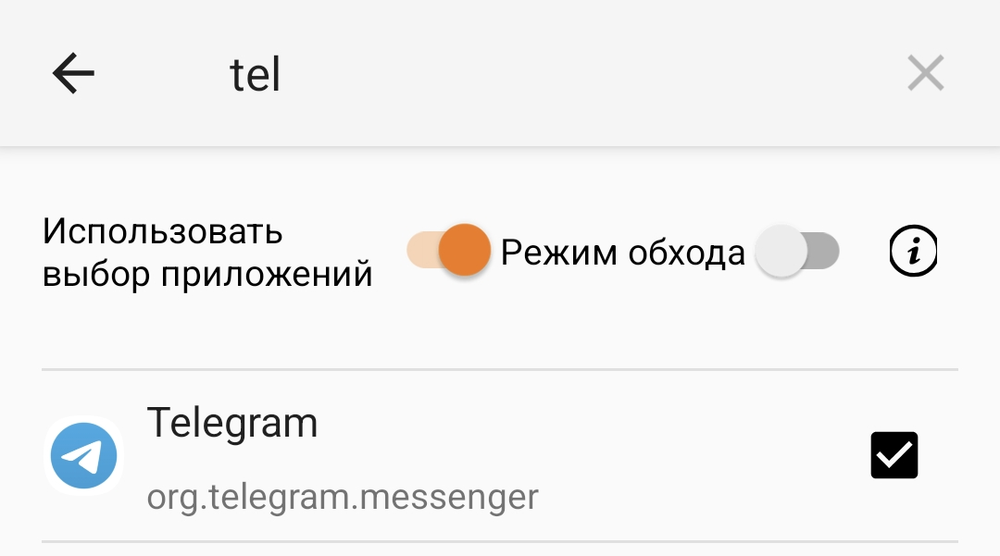

## Настройка клиентов XRAY

### Загрузка и установка приложений

#### Android
[Releases · 2dust/v2rayNG](https://github.com/2dust/v2rayNG/releases/)

1. Выбрать Latest, не pre-release
2. В подразделе Assets выбрать файл APK с universal в имени.
3. Скачать, установить.

<div style="width: 50%;"></div>

#### Windows
[https://github.com/2dust/v2rayN/releases](https://github.com/2dust/v2rayN/releases)


#### iOS
[Приложение «OneXray» — App Store](https://apps.apple.com/ru/app/onexray/id6745748773)

### Импорт конфигурации в приложение с помощью ссылки

1. Скопировать ссылку вида VLESS:// в буфер обмена.
2. В приложении нажать ➕, затем Импорт из буфера обмена.

### Настройка проксирования приложений (только Android)
1. Меню ≡  - Выбор приложений - Использовать выбор приложений: включить
2. Выбрать из списка приложения, которые должны ходить через сервер.



### Импорт / настройка маршрутизации
1/ Скопировать набор правил в буфер обмена 

```
[{"enabled":true,"locked":true,"outboundTag":"direct","protocol":["bittorent"],"remarks":"Torrent - direct"},{"enabled":true,"ip":["geoip:private"],"locked":true,"outboundTag":"direct","remarks":"geoip:private - direct "},{"domain":["geosite:private"],"enabled":true,"locked":true,"outboundTag":"direct","remarks":"geosite:private - direct "},{"enabled":false,"ip":["1.0.0.1","1.1.1.1","8.8.8.8","8.8.4.4"],"locked":true,"outboundTag":"proxy","remarks":"DNS - proxy"},{"domain":["720pier.ru"],"enabled":true,"locked":true,"outboundTag":"proxy","remarks":"RU - Proxy"},{"domain":["reddit.com","nytimes.com"],"enabled":true,"locked":true,"outboundTag":"direct","remarks":"My Domains - direct"},{"domain":["domain:ru","domain:xn--p1ai","ya.ru"],"enabled":true,"locked":true,"outboundTag":"direct","remarks":"RU, РФ - direct"},{"enabled":true,"locked":true,"outboundTag":"proxy","port":"0-65535","remarks":"All other - proxy"}]
```

2. Меню ≡ - Маршрутизация - ︙(в правом верхнем углу) - Импорт правил из буфера обмена и согласиться на удаление существующих правил.


