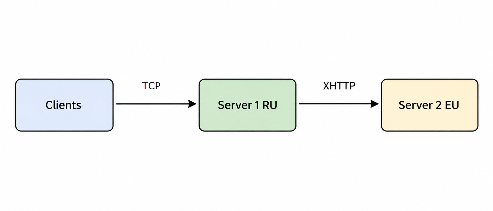

# Настройка сервера XRAY на VPS (быстрый старт)

**Содержание**
<!-- ``- [Настройка сервера XRAY на VPS (быстрый старт)](#настройка-сервера-xray-на-vps-быстрый-старт)
  - [Об этом документе](#об-этом-документе)
  - [Стратегия](#стратегия)
  - [Установка и настройка сервера XRAY](#установка-и-настройка-сервера-xray)
    - [Диаграмма подключений](#диаграмма-подключений)
    - [Конфигурационные файлы](#конфигурационные-файлы)
      - [Сервер 1 в РФ](#сервер-1-в-рф)
      - [Сервер 2 в Европе](#сервер-2-в-европе)
    - [Загрузка и обновление геофайлов](#загрузка-и-обновление-геофайлов)
      - [Скрипт загрузки геофайлов](#скрипт-загрузки-геофайлов)
      - [Обновление геофайлов по расписанию](#обновление-геофайлов-по-расписанию)
    - [Ротация логов](#ротация-логов)
 -->

## Об этом документе
Это нечто вроде личных заметок, вынесенных в паблик. Получился "еще один гайд" - поверхностный, чтобы не раздумывая копировать и вставлять команды в консоль, и достаточный для новчика. Остальное в документации: [https://xtls.github.io/ru/config/](https://xtls.github.io/ru/config/).

См. также [Первоначальная настройка VPS](vps.md)

## Стратегия
Чтобы снизить риск выявления серверов, стратегия должна сочетать серверную инфраструктуру с маршрутизацией трафика на клиентах и серверах. 
Рассмотрим возможные конфигурации:
- **Клиент в РФ -> Сервер 1 за рубежом**. Самая уязвимая конфигурация. Выходной сервер может быть выявлен шпионскими приложениями на клиенте и анализом трафика на уровне провайдера - на пути от клиента к зарубежному серверу.
- **Клиент в РФ -> Сервер 1 в РФ -> Сервер 2 за рубежом**. Более устойчивая конфигурация. Нивелируется анализ трафика на уровне провайдеров, но сохраняется риск выявления шпионами на клиенте.
- **Клиент в РФ -> Сервер 1 в РФ -> Сервер 2 за рубежом -> Сервер 3 за рубежом**. Оптимальная конфигурация. Даже если шпион на клиенте выявляет выходной сервер, его блокировка в РФ ни на что не влияет. Ведь вы ходите на него из-за рубежа.

См. также в подробностях и схемах: [Строим VPN, устойчивый к SpyWare](https://habr.com/ru/articles/1022586/) ([копия в веб-архиве](https://web.archive.org/web/20260413043803/https://habr.com/ru/articles/1022586/)).

Выбор стратегии незначительно влияет на базовую настройку серверов. Все они должны принимать входящий трафик для подключения клиентов (даже если ими выступают серверы 2 и 3) и исходящий трафик на следующий сервер либо наружу.

## Установка и настройка сервера XRAY

1. Определить последнюю стабильную версию: [https://github.com/XTLS/Xray-core/releases/](https://github.com/XTLS/Xray-core/releases/)

2. Подставить номер версии в команду установки вместо 26.2.6
```
sudo bash -c "$(curl -L https://raw.githubusercontent.com/XTLS/Xray-install/046d9aa2432b3a6241d73c3684ef4e512974b594/install-release.sh)" @ install --version 26.2.6
```
3. Включить сервер
```
sudo systemctl enable xray
```
4. Сгенерировать пару ключей и shortID
```
/usr/local/bin/xray x25519 #key pair
openssl rand -hex 8 #shortid
```
5. Сгенерировать UUID - лучше создавать свой для каждого человека пользователя или группы
```
/usr/local/bin/xray uuid #uuid
```
6. Создать конфигурационный файл (пример ниже)
```
sudo nano /usr/local/etc/xray/config.json
```
Вставить туда содержимое файла и сохранить Ctrl+X.

**Примечание**. Вставка большого конфигурационного файла может не сработать, если провайдер режет объемы данных по SSH. Тогда файл можно загрузить по SFTP.

7. Запустить сервер
Команда перезапускает сервер, отображает статус и отслеживает лог.
```
sudo systemctl restart xray && sudo systemctl status xray && sudo journalctl -u xray -f
```

### Диаграмма подключений
Здесь вариант со схемой **Сервер 1 в РФ -> Сервер 2 за рубежом**. Для разнообразия примеров используется разный транспорт: от клиентов к серверу 1 - XTLS Reality, от сервера 1 к 2 - XHTTP. Еще один зарубежный сервер настраивается аналогично. 



### Конфигурационные файлы
В файлах необходимо прописать свои параметры:
- приватные и публичные ключи серверов (вместо `PRIVATE_KEY_SERVER1` / `PRIVATE_KEY_SERVER2` и `PUBLIC_KEY_SERVER1` / `PUBLIC_KEY_SERVER2`), а также ShortID, полученные командами из шага 4 в предыдущем разделе
- UUID каждого клиента, полученные командой из шага 5 выше (обратите внимание, что Сервер 1 также является клиентом для Сервер 2)
- произвольные адреса e-mail каждого клиента (необязательно, но они могут упростить анализ логов и/или маршрутизацию)
- SNI - адрес легитимного сервера (вместо `example.sni`), под который будет маскироваться ваш сервер. Выше в списке - лучше:
  -  свой домен на том же сервере, замаскированный под корпоративный бэкенд
  -  крупный чужой домен на том же сервере, сканирование можно выполнить с помощью [RealiTLScanner](https://github.com/XTLS/RealiTLScanner/releases):
  `.\RealiTLScanner-windows-64.exe -addr <VPS IP>`
  -  крупный чужой домен в стране сервера

#### Сервер 1 в РФ

```json
{
    "log": {
        "access": "/var/log/xray/access.log",
        "error": "/var/log/xray/error.log",
        "loglevel": "warning"
    },
    "inbounds": [
        {
            "port": 443,
            "protocol": "vless",
            "tag": "vless_xtls",
            "settings": {
                "clients": [
                    {
                        "id": "a1912b0a-0cfc-427d-9f85-eaedd972c0db",
                        "email": "user1@xtls",
                        "flow": "xtls-rprx-vision"
                    },
                    {
                        "id": "ddae7351-3924-4eac-8fee-f44e11552ec3",
                        "email": "user2@xtls",
                        "flow": "xtls-rprx-vision"
                    }
                ],
                "decryption": "none"
            },
            "streamSettings": {
                "network": "tcp",
                "security": "reality",
                "realitySettings": {
                    "show": false,
                    "dest": "www.example.sni:443",
                    "xver": 0,
                    "serverNames": [
                        "www.example.sni"
                    ],
                    "privateKey": "PRIVATE_KEY_SERVER1",
                    "minClientVer": "",
                    "maxClientVer": "",
                    "maxTimeDiff": 0,
                    "shortIds": [
                        "d682fd84f40b05cb"
                    ]
                }
            },
            "sniffing": {
                "destOverride": [
                    "http",
                    "tls"
                ]
            }
        }
    ],
    "outbounds": [
        {
            "tag": "proxy",
            "protocol": "vless",
            "settings": {
                "vnext": [
                    {
                        "address": "IP_SERVER2",
                        "port": 443,
                        "users": [
                            {
                                "id": "adb25d51-0c21-48c3-bcab-d38acca1b567",
                                "email": "serverRU@xhttp",
                                "encryption": "none"
                            }
                        ]
                    }
                ]
            },
            "streamSettings": {
                "network": "xhttp",
                "security": "reality",
                "allowInsecure": false,
                "sockopt": {
                    "mark": 4
                },
                "realitySettings": {
                    "fingerprint": "chrome",
                    "serverName": "www.microsoft.com",
                    "publicKey": "PUBLIC_KEY_SERVER2",
                    "spiderX": "",
                    "shortId": "d682fd84f40b05cb"
                },
                "xhttpSettings": {
                    "path": "/api/v1/data",
                    "mode": "stream-one",
                    "extra": {
                        "xPaddingBytes": "100-1000"
                    }
                }
            }
        },
        {
            "tag": "direct",
            "protocol": "freedom"
        },
        {
            "tag": "domain-ru",
            "protocol": "freedom"
        },
        {
            "tag": "ip-ru",
            "protocol": "freedom"
        },
        {
            "tag": "ip-geo-detect",
            "protocol": "blackhole"
        },
        {
            "tag": "block",
            "protocol": "blackhole"
        }
    ],
    "dns": {
        "servers": [
            {
                "address": "https://dns.google/dns-query",
                "domains": [
                    "geoip:!private"
                ]
            },
            {
                "address": "https://1.1.1.1/dns-query",
                "domains": [
                    "geoip:!private"
                ]
            },
            {
                "address": "https://unfiltered.adguard-dns.com/dns-query",
                "domains": [
                    "geoip:!private"
                ]
            },
            "localhost"
        ]
    },
    "routing": {
        "domainStrategy": "IPIfNonMatch",
        "rules": [
            {
                "type": "field",
                "outboundTag": "block",
                "protocol": [
                    "bittorrent"
                ],
                "remarks": "Блокировать Торрент"
            },
            {
                "domain": [
                    "geosite:category-ads-all"
                ],
                "type": "field",
                "outboundTag": "block",
                "remarks": "Блокировать рекламу"
            },
            {
                "domain": [
                    "geosite:category-ip-geo-detect"
                ],
                "type": "field",
                "outboundTag": "ip-geo-detect",
                "remarks": "Сервисы определения IP - блокировать"
            },
            {
                "ip": [
                    "geoip:private"
                ],
                "type": "field",
                "outboundTag": "direct",
                "remarks": "Частные сети - напрямую"
            },
            {
                "domain": [
                    "geosite:private"
                ],
                "type": "field",
                "outboundTag": "direct",
                "remarks": "Частные домены - напрямую"
            },
            {
                "domain": [
                    "somedomain.ru"
                ],
                "type": "field",
                "outboundTag": "proxy",
                "remarks": "Избранные сайты .RU - прокси"
            },
            {
                "domain": [
                    "geosite:category-ru"
                ],
                "type": "field",
                "outboundTag": "domain-ru",
                "remarks": "Российские домены"
            },
            {
                "domain": [
                    "domain:ru",
                    "domain:xn--p1ai",
                    "domain:su"
                ],
                "type": "field",
                "outboundTag": "domain-ru",
                "remarks": "Домены .RU, .РФ "
            },
            {
                "ip": [
                    "geoip:ru"
                ],
                "type": "field",
                "outboundTag": "ip-ru",
                "remarks": "Российские IP"
            },
            {
                "type": "field",
                "outboundTag": "proxy",
                "port": "0-65535",
                "remarks": "Все остальное - прокси"
            }
        ]
    }
}
```
Пояснения
- К серверу 1 два клиента подключаются по протоколу VLESS посредством XTLS Reality, остальные клиенты добавляются аналогично
- Сервер 1 также выступает клиентом для сервера 2 за рубежом, к которому подключается по протоколу VLESS посредством XHTTP
- Правила маршрутизации блокируют торренты, рекламу, а также популярные серверы проверки IP-адресов, чтобы снизить риск выяввления выходного сервера
- Правила машрутизации маркируют трафик российских IP и доменов выделенными тегами `"outboundTag": "domain-ru"` и  `"outboundTag": "ip-ru"`
- Объект `outbounds` направляет трафик этих тегов напрямую , т.е. не выпускает за рубеж.
```json
        {
            "tag": "domain-ru",
            "protocol": "freedom"
        },
        {
            "tag": "ip-ru",
            "protocol": "freedom"
        },
```
- Если трафик хорошо маршрутизируется на клиентах, можно блокировать российский трафик, просто изменив протокол: `"protocol": "blackhole"`. То есть даже не меняя правила маршрутизации.

#### Сервер 2 в Европе
```json
{
    "log": {
        "access": "/var/log/xray/access.log",
        "error": "/var/log/xray/error.log",
        "loglevel": "warning"
    },
    "inbounds": [
        {
            "port": 443,
            "protocol": "vless",
            "tag": "vless_xhttp",
            "settings": {
                "clients": [
                    {
                        "id": "adb25d51-0c21-48c3-bcab-d38acca1b567",
                        "email": "serverRU@xhttp"
                    }
                ],
                "decryption": "none"
            },
            "streamSettings": {
                "network": "xhttp",
                "security": "reality",
                "realitySettings": {
                    "show": false,
                    "dest": "www.microsoft.com:443",
                    "xver": 0,
                    "serverNames": [
                        "www.microsoft.com"
                    ],
                    "privateKey": "PRIVATE_KEY_SERVER2",
                    "minClientVer": "",
                    "maxClientVer": "",
                    "maxTimeDiff": 0,
                    "shortIds": [
                        "d682fd84f40b05cb"
                    ]
                },
                "xhttpSettings": {
                    "path": "/api/v1/data",
                    "mode": "stream-one",
                    "extra": {
                        "xPaddingBytes": "100-1000"
                    }
                }
            },
            "sniffing": {
                "destOverride": [
                    "http",
                    "tls",
                    "quic"
                ]
            }
        }
    ],
    "dns": {
        "servers": [
            {
                "address": "https://dns.google/dns-query",
                "domains": [
                    "geoip:!private"
                ]
            },
            {
                "address": "https://1.1.1.1/dns-query",
                "domains": [
                    "geoip:!private"
                ]
            },
            {
                "address": "https://unfiltered.adguard-dns.com/dns-query",
                "domains": [
                    "geoip:!private"
                ]
            },
            "localhost"
        ]
    },
    "routing": {
        "domainStrategy": "IPIfNonMatch",
        "rules": [
             {
                "type": "field",
                "inboundTag": [
                    "vless_xhttp"
                ],
                "outboundTag": "direct",
                "remarks": "Весь входящий трафик с первого сервера - напрямую"
            }
        ]
    },
    "outbounds": [
        {
            "protocol": "freedom",
            "tag": "direct"
        },
         {
            "tag": "block",
            "protocol": "blackhole"
        }
    ]
}
```
Пояснения
- Сервер 2 принимает трафик только от Сервера 1. То есть в объекте `inbounds` единственный клиент - это Сервер 1, и он имеет тот же UUID, что в объекте `outbounds` конфигурации Сервера 1
- Весь трафик выпускается наружу без фильтрации, но можно дополнительно применять правила машрутизации - блокировать или перенаправлять на следующий сервер, если имеется

### Загрузка и обновление геофайлов
В комплекте с сервером идут какие-то геофайлы, но они не обновляются. В примере ниже файлы берутся из репозитория [https://github.com/Loyalsoldier/v2ray-rules-dat](https://github.com/Loyalsoldier/v2ray-rules-dat).

#### Скрипт загрузки геофайлов

1.Создайте файл `nano xray-geo.sh`
2. Вставьте код:
```
#!/bin/bash
# doc https://xtls.github.io/en/config/features/env.html#resource-file-path
# default: /usr/local/share/xray/


LOGFILE='/var/log/geofiles.update.log'

echo "$(date) Start......." >> $LOGFILE

rm -rf /tmp/geodata && mkdir /tmp/geodata
cd /tmp/geodata

if  [ $? -eq 0 ]; then
echo "$(date) Download phase is starting...." >> $LOGFILE
else
echo "$(date) Something went wrong during folders preparation. Exiting..." >> $LOGFILE
exit 1
fi

wget -q https://github.com/Loyalsoldier/v2ray-rules-dat/releases/latest/download/geosite.dat && \
wget -q https://github.com/Loyalsoldier/v2ray-rules-dat/releases/latest/download/geoip.dat && \
wget -q -O geocdn.dat https://github.com/PentiumB/CDN-RuleSet/releases/latest/download/geoip.dat

if  [ $? -eq 0 ]; then
echo "$(date) Download phase completed successfully" >> $LOGFILE
if [ -d "/usr/local/share/xray/backup" ]; then
  cp /usr/local/share/xray/geo*.dat /usr/local/share/xray/backup/
else
  mkdir /usr/local/share/xray/backup && cp /usr/local/share/xray/geo*.dat /usr/local/share/xray/backup/
fi

cp /tmp/geodata/geo*.dat /usr/local/share/xray/
echo "$(date) Download phase completed successfully" >> $LOGFILE
else
echo "$(date) Download phase did not completed successfully. Exiting" >> $LOGFILE
exit 1
fi


if  [ $? -eq 0 ]; then
systemctl restart xray.service && echo "$(date) Service Restart completed successfully" >> $LOGFILE
else
echo "$(date) Backup & Replace phase did not completed successfully" >> $LOGFILE
fi
```
3. Сделайте скрипт исполняемым: `chmod +x xray-geo.sh`

#### Обновление геофайлов по расписанию

1. Откройте планировщик: `sudo crontab -e`
2. Вставьте: 
```
CRON_TZ=UTC
5 6 * * * /home/user/xray-geo.sh
```

### Ротация логов

Ротировать логи рекомендуется для экономии места, особенно если уровень выше warn.

1. Выполните `sudo nano /etc/logrotate.d/xray`
2. Вставьте код и сохраните
```
/var/log/xray/error.log {
    size 100M
    rotate 5
    daily
    compress
    copytruncate
    maxage 7
}

/var/log/xray/access.log {
    size 300M
    rotate 5
    daily
    compress
    copytruncate
    maxage 7
}
```
3. Проверьте
```
sudo logrotate -f /etc/logrotate.d/xray
sudo ls -lh /var/log/xray
```

Если logrotate не установлен, установите
```
sudo apt update
sudo apt install logrotate -y
```

Примеры поиска по логам:
```
grep "something" /var/log/xray/access.log
zgrep "something" /var/log/xray/*.gz
```